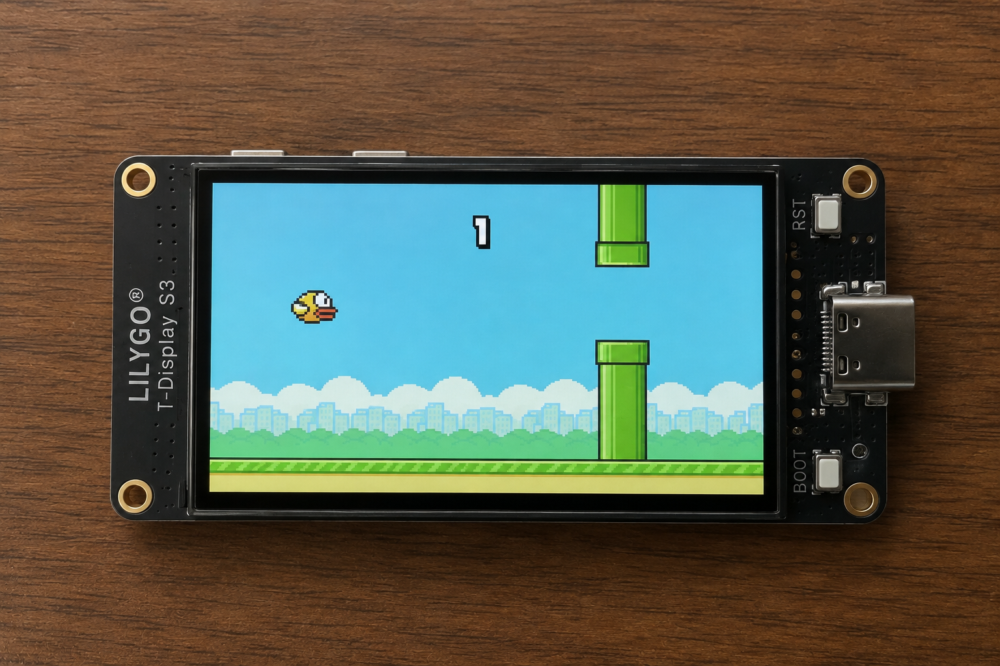

# ⚡️ Satoshi Bird

A pay-to-play Flappy Bird-style game powered by Bitcoin Lightning on the LILYGO T-Display ESP32.

**Satoshi Bird** is an open-source project that allows you to play a Flappy Bird clone by sending a Bitcoin Lightning payment.

This version runs in **Standalone Mode**, meaning the ESP32 connects directly to the [Blink (formerly Galoy) API](https://blink.sv) to monitor payments in real-time—no external server or backend required.

## 🚀 How it Works
1. The **ESP32** connects to your WiFi.
2. It polls the Blink API every 3 seconds to check for new incoming transactions.
3. When a successful payment is detected, it unlocks a game session of Satoshi Bird.

## 📂 Structure
- `firmware/`: PlatformIO project for ESP32 (Arduino framework).

## 🛠 Prerequisites
- **Hardware**: LILYGO T-Display ESP32.
- **Software**: PlatformIO (VSCode Extension recommended).
- **Account**: A [Blink Wallet](https://blink.sv) account and an API Key.

## ⚙️ Setup

### 1. Configure the Firmware
Open `firmware/src/main.cpp` and update the following:
- `BLINK_API_KEY`: Generate this in your [Blink Dashboard](https://dashboard.blink.sv).

### 2. Flash the Firmware
1. Connect your ESP32 via USB.
2. Open the `firmware` folder in VSCode with the PlatformIO extension.
3. Click **Upload** (or run `pio run --target upload` in the terminal).

### 3. WiFi Configuration
On the first boot (or if WiFi is lost), the ESP32 will host its own WiFi network:
- **SSID**: `Satoshi-Bird`
- **Password**: `bitcoin123`

Connect to this network with your phone or PC, and a portal will open to let you select your local WiFi and enter the password.

## 🔒 Security
- **API Key**: Keep your `BLINK_API_KEY` private. Do not share your compiled binaries if they contain your real key.
- **Standalone**: Because it polls directly, there is no need for port forwarding or exposing a server to the internet.

## 📄 License
This project is licensed under the MIT License.

---
*Built with 🧡 for the Bitcoin community.*
